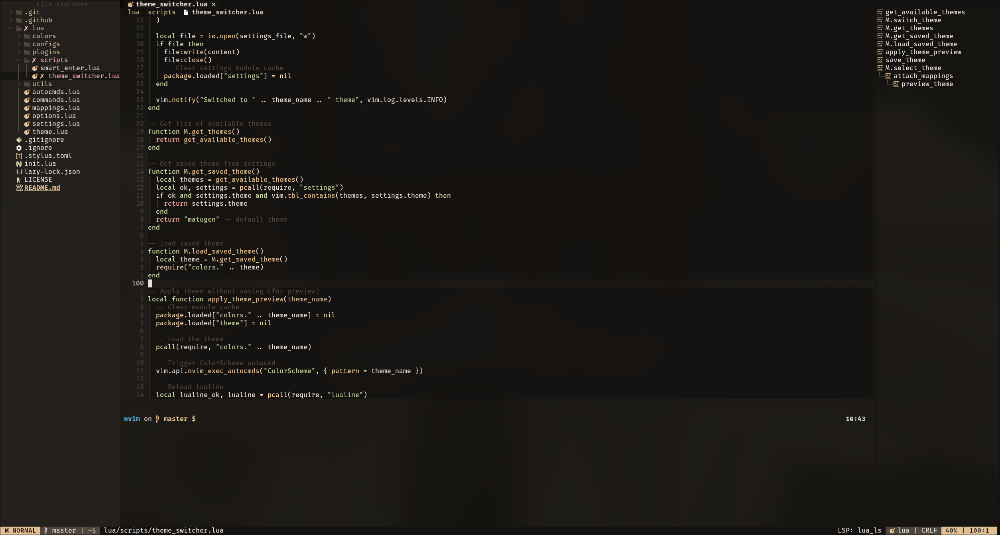
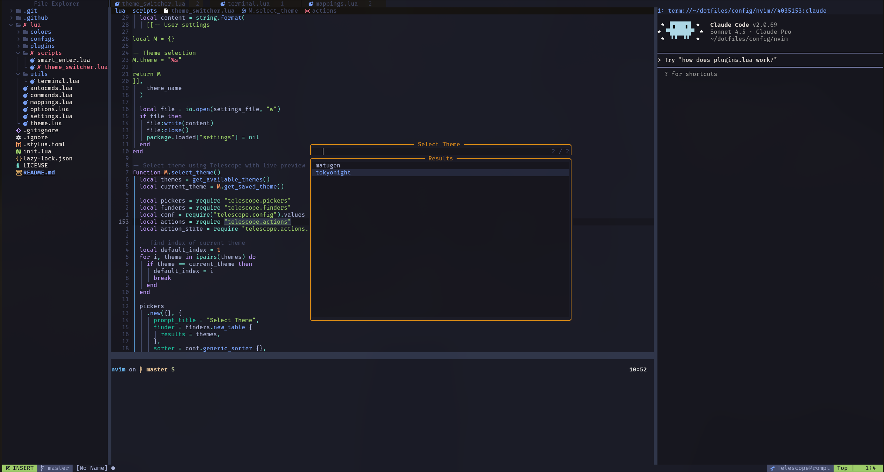
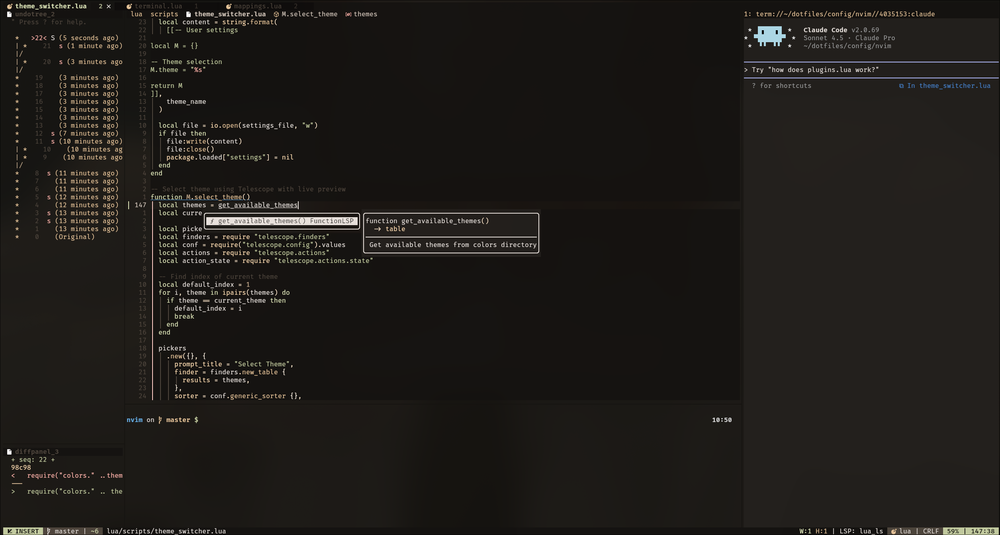
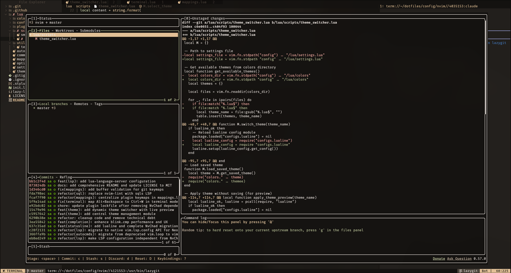

# Neovim Configuration

> A modern, feature-rich Neovim configuration evolved from NvChad into a fully independent setup


## Table of Contents

- [Overview](#overview)
- [Screenshots](#screenshots)
- [Requirements](#requirements)
- [Installation](#installation)
- [Configuration Structure](#configuration-structure)
- [Features](#features)
- [Keybindings](#keybindings)
  - [General](#general)
  - [Window Navigation](#window-navigation)
  - [Buffer Management](#buffer-management)
  - [Telescope](#telescope-fuzzy-finder)
  - [Git](#git)
  - [LSP](#lsp)
  - [Debugging](#debugging)
  - [Terminal](#terminal)
  - [Utilities](#utilities)
  - [Sessions](#sessions)
- [Customization](#customization)
- [Language Server Configuration](#language-server-configuration)
- [Performance Optimizations](#performance-optimizations)
- [Troubleshooting](#troubleshooting)
- [Credits & Acknowledgments](#credits--acknowledgments)
- [License](#license)

## Overview

This Neovim configuration started as a NvChad setup and has been gradually migrated to a completely independent configuration. It features a carefully curated selection of plugins, modern LSP integration, and a custom theme system with live switching capabilities.

**Key Highlights:**

- 🚀 54+ carefully selected plugins with lazy loading
- 🎨 Custom theme system with live preview (Matugen & Tokyo Night)
- ⚡ Fast completion with blink.cmp (Rust-based)
- 🔧 Full LSP support for Go, Python, TypeScript/JavaScript, Lua, HTML/CSS, SQL
- 🐛 Built-in DAP debugging for Go and Python
- 📝 Smart terminal management with custom utilities
- 🎯 Centralized keybindings for easy customization
- 🌳 Advanced Git integration (LazyGit, diffview, conflict resolution)

## Screenshots

|                                                                                                           |                                                                                                    |
| :-------------------------------------------------------------------------------------------------------: | :------------------------------------------------------------------------------------------------: |
| <br>_Main editor view with statusline and file tree_ | <br>_Live theme preview with Telescope_ |
|       <br>_Code completion and diagnostics_        |        <br>_LazyGit interface_        |

## Requirements

- **Neovim** >= 0.10.0 (0.11+ recommended for latest LSP features)
- **Git** >= 2.19.0
- **Node.js** (for some LSP servers)
- **Python** (for Python LSP and debugging)
- **Go** (for Go LSP and debugging)
- **ripgrep** (for Telescope grep)
- **fd** (optional, for faster file finding)
- A [Nerd Font](https://www.nerdfonts.com/) (recommended: JetBrainsMono Nerd Font)
- Terminal with true color support

## Installation

### 1. Backup your existing configuration

```bash
mv ~/.config/nvim ~/.config/nvim.backup
mv ~/.local/share/nvim ~/.local/share/nvim.backup
mv ~/.local/state/nvim ~/.local/state/nvim.backup
```

### 2. Clone this repository

```bash
git clone https://github.com/say8hi/nvim-config ~/.config/nvim
```

### 3. Start Neovim

```bash
nvim
```

Lazy.nvim will automatically install all plugins on first launch.

### 4. Install LSP servers and formatters

After Neovim starts, run:

```vim
:MasonInstallAll
```

This will install all configured LSP servers, formatters, and linters:

- gopls, gofumpt, goimports-reviser, golines (Go)
- pyright, ruff, black, debugpy (Python)
- typescript-language-server, prettier (TypeScript/JavaScript)
- html-lsp, css-lsp, json-lsp (Web)
- sqls (SQL)
- lua-language-server, stylua (Lua)

## Configuration Structure

```
~/.config/nvim/
├── init.lua                    # Entry point
├── lazy-lock.json              # Plugin version lock
├── lua/
│   ├── options.lua             # Editor options
│   ├── settings.lua            # User preferences (theme selection)
│   ├── mappings.lua            # All keybindings (centralized)
│   ├── commands.lua            # Custom user commands
│   ├── autocmds.lua            # Auto-commands
│   ├── theme.lua               # Theme color management
│   ├── configs/                # Plugin-specific configurations
│   │   ├── lazy.lua            # Lazy.nvim settings
│   │   ├── lsp.lua             # LSP server configurations
│   │   ├── conform.lua         # Formatter settings
│   │   ├── lualine.lua         # Status line
│   │   ├── nvimtree.lua        # File explorer
│   │   ├── telescope.lua       # Fuzzy finder
│   │   └── treesitter.lua      # Syntax parser
│   ├── plugins/
│   │   └── init.lua            # Plugin declarations
│   ├── scripts/                # Custom utilities
│   │   ├── theme_switcher.lua  # Dynamic theme switcher
│   │   └── smart_enter.lua     # Smart string handling
│   ├── utils/
│   │   └── terminal.lua        # Terminal management
│   └── colors/                 # Custom color schemes
│       ├── matugen.lua         # Matugen theme (default)
│       └── tokyonight.lua      # Tokyo Night theme
└── .stylua.toml                # Lua formatter configuration
```

## Features

### Core UI & Navigation

- **snacks.nvim** - Notifications, debugging utilities, UI enhancements
- **lualine.nvim** - Beautiful statusline with LSP info and diagnostics
- **bufferline.nvim** - Buffer tabs with diagnostics integration
- **barbecue.nvim** - Breadcrumbs showing code context (file > class > function)
- **nvim-tree.lua** - File explorer with custom delete handler
- **which-key.nvim** - Keybinding popup helper
- **noice.nvim** - Enhanced UI for messages and cmdline
- **dressing.nvim** - Better vim.ui components

### Code Intelligence & LSP

- **Built-in LSP** with modern `vim.lsp.config` API (Neovim 0.11+)
- **blink.cmp** - Lightning-fast Rust-based completion engine
- **nvim-treesitter** - Advanced syntax highlighting and code understanding
- **aerial.nvim** - Code outline and symbol viewer
- **vim-illuminate** - Highlight word under cursor across buffer
- **nvim-ufo** - Modern folding with treesitter/LSP integration
- **todo-comments.nvim** - Highlight and search TODO/FIXME comments

### Language Support

- **Go**: gopls LSP, gopher.nvim utilities, DAP debugging
- **Python**: pyright + ruff LSP, black formatter, DAP debugging
- **TypeScript/JavaScript**: ts_ls LSP, prettier formatter
- **Lua**: Built-in LSP with stylua formatter
- **HTML/CSS**: Full LSP support with prettier
- **SQL**: sqls LSP with sqlfluff formatter

### Git Integration

- **gitsigns.nvim** - Git decorations, hunk operations, inline blame
- **lazygit.nvim** - Full LazyGit integration
- **git-conflict.nvim** - Visual merge conflict resolution
- **diffview.nvim** - Advanced diff and merge tool

### Debugging

- **nvim-dap** - Debug Adapter Protocol client
- **nvim-dap-ui** - Beautiful debugging UI
- **nvim-dap-go** - Go debugging configuration
- **nvim-dap-python** - Python debugging configuration

### Text Editing & Motion

- **flash.nvim** - Enhanced f/t/search navigation
- **nvim-spider** - Smart word motion (camelCase/snake_case aware)
- **nvim-surround** - Add/change/delete surrounding characters
- **nvim-autopairs** - Auto-close brackets and quotes
- **vim-visual-multi** - Multiple cursors (Ctrl+b)
- **Comment.nvim** - Smart code commenting

### Utilities

- **telescope.nvim** - Fuzzy finder for files, buffers, grep, and more
- **harpoon** - Quick file navigation bookmarks
- **nvim-neoclip.lua** - Clipboard manager with history
- **undotree** - Visual undo history
- **persistence.nvim** - Session management
- **mini.bufremove** - Smart buffer deletion preserving windows
- **mini.icons** - Modern icon provider
- **claudecode.nvim** - AI coding assistant integration

### Custom Features

- **Theme Switcher** - Live theme preview with Telescope integration
- **Terminal Manager** - Smart terminal splits (horizontal/vertical/floating)
- **Smart Enter** - Intelligent string breaking in insert mode
- **MasonInstallAll** - One command to install all tools

## Keybindings

> For a complete list of keybindings, press `<leader>wK` in Neovim

### General

| Key     | Mode   | Description        |
| ------- | ------ | ------------------ |
| `Space` | Normal | Leader key         |
| `jk`    | Insert | Quick escape       |
| `<C-s>` | Normal | Save file          |
| `<C-c>` | Normal | Copy entire file   |
| `;`     | Normal | Enter command mode |

### Window Navigation

| Key           | Mode   | Description             |
| ------------- | ------ | ----------------------- |
| `<C-h/j/k/l>` | Normal | Navigate between splits |
| `<C-n>`       | Normal | Toggle file tree        |
| `<leader>e`   | Normal | Focus file tree         |

### Buffer Management

| Key          | Mode   | Description             |
| ------------ | ------ | ----------------------- |
| `<Tab>`      | Normal | Next buffer             |
| `<S-Tab>`    | Normal | Previous buffer         |
| `<leader>x`  | Normal | Close current buffer    |
| `<leader>X`  | Normal | Close all other buffers |
| `<leader>bp` | Normal | Buffer picker           |

### Telescope (Fuzzy Finder)

| Key          | Mode   | Description             |
| ------------ | ------ | ----------------------- |
| `<leader>ff` | Normal | Find files              |
| `<leader>fa` | Normal | Find all files (hidden) |
| `<leader>fw` | Normal | Live grep               |
| `<leader>fb` | Normal | Find buffers            |
| `<leader>fo` | Normal | Recent files            |
| `<leader>fz` | Normal | Fuzzy find in buffer    |
| `<leader>ft` | Normal | Find TODOs              |
| `<leader>u`  | Normal | Undo history            |
| `<leader>o`  | Normal | Clipboard history       |

### Git

| Key          | Mode   | Description         |
| ------------ | ------ | ------------------- |
| `<leader>gg` | Normal | LazyGit             |
| `<leader>cm` | Normal | Git commits         |
| `<leader>gt` | Normal | Git status          |
| `<leader>dv` | Normal | Diff view           |
| `]c` / `[c`  | Normal | Next/Previous hunk  |
| `<leader>hs` | Normal | Stage hunk          |
| `<leader>hr` | Normal | Reset hunk          |
| `<leader>hp` | Normal | Preview hunk        |
| `<leader>hb` | Normal | Git blame           |
| `<leader>hB` | Normal | Toggle inline blame |

### Git Conflicts

| Key          | Mode   | Description            |
| ------------ | ------ | ---------------------- |
| `<leader>co` | Normal | Choose ours            |
| `<leader>ct` | Normal | Choose theirs          |
| `<leader>cb` | Normal | Choose both            |
| `<leader>c0` | Normal | Choose none            |
| `]x` / `[x`  | Normal | Next/Previous conflict |

### LSP

| Key          | Mode   | Description              |
| ------------ | ------ | ------------------------ |
| `gd`         | Normal | Go to definition         |
| `gD`         | Normal | Go to declaration        |
| `gr`         | Normal | Show references          |
| `gi`         | Normal | Go to implementation     |
| `K`          | Normal | Hover documentation      |
| `gK`         | Normal | Signature help           |
| `<leader>D`  | Normal | Type definition          |
| `<leader>ra` | Normal | Rename symbol            |
| `<leader>ca` | Normal | Code action              |
| `<leader>f`  | Normal | Format buffer            |
| `gl`         | Normal | Line diagnostics         |
| `]d` / `[d`  | Normal | Next/Previous diagnostic |

### Debugging

| Key           | Mode   | Description          |
| ------------- | ------ | -------------------- |
| `<leader>db`  | Normal | Toggle breakpoint    |
| `<leader>dc`  | Normal | Continue/Start debug |
| `<leader>du`  | Normal | Toggle DAP UI        |
| `dn`          | Normal | Step over            |
| `<leader>dgt` | Normal | Debug Go test        |

### Terminal

| Key     | Mode     | Description          |
| ------- | -------- | -------------------- |
| `<A-h>` | Normal   | Horizontal terminal  |
| `<A-v>` | Normal   | Vertical terminal    |
| `<A-i>` | Normal   | Floating terminal    |
| `<C-x>` | Terminal | Escape terminal mode |

### Utilities

| Key          | Mode          | Description           |
| ------------ | ------------- | --------------------- |
| `<leader>th` | Normal        | Theme switcher        |
| `<leader>ut` | Normal        | Undo tree             |
| `<leader>n`  | Normal        | Toggle line numbers   |
| `<leader>/`  | Normal/Visual | Toggle comment        |
| `<leader>un` | Normal        | Dismiss notifications |
| `<leader>nh` | Normal        | Notification history  |

### Sessions

| Key          | Mode   | Description          |
| ------------ | ------ | -------------------- |
| `<leader>qs` | Normal | Restore session      |
| `<leader>ql` | Normal | Restore last session |
| `<leader>qd` | Normal | Don't save session   |

## Customization

### Change Theme

1. Open theme switcher: `<leader>th`
2. Preview themes with live updates
3. Press Enter to apply

Or edit `lua/settings.lua`:

```lua
M.theme = "matugen"  -- or "tokyonight"
```

> **Note:** The Matugen theme uses dynamic colors generated by [matugen](https://github.com/InioX/matugen). For matugen configuration example, see [dotfiles/config/matugen](https://github.com/say8hi/dotfiles/tree/master/config/matugen).

### Add Your Own Theme

1. Create a new file in `lua/colors/mytheme.lua`
2. Define Base16 colors following the existing pattern
3. Select it in :ThemeSwitch (`<leader>th`)

### Modify Keybindings

All keybindings are centralized in `lua/mappings.lua`. Edit this file to customize or add new mappings.

### Add Plugins

Edit `lua/plugins/init.lua` and add your plugin specification following the Lazy.nvim format:

```lua
{
  "author/plugin-name",
  event = "VeryLazy",  -- or other lazy loading options
  opts = {
    -- plugin options
  },
}
```

## Language Server Configuration

LSP servers are configured in `lua/configs/lsp.lua` using Neovim's modern built-in API (`vim.lsp.config` and `vim.lsp.enable`).

To add a new language server:

1. Install via Mason: `:MasonInstall <server-name>`
2. Add configuration in `lua/configs/lsp.lua`
3. Add to the `servers` table

## Performance Optimizations

- **Lazy loading**: Plugins load on-demand (events, filetypes, commands)
- **Disabled providers**: Node, Python, Perl, Ruby providers disabled for speed
- **Large file handling**: Auto-disables heavy features for files > 100KB
- **Fast terminal**: `termguicolors` and `ttyfast` enabled
- **Persistent undo**: 10,000 levels with file-based undo history

## Troubleshooting

### Plugins not loading

```vim
:Lazy sync
:Lazy clean
```

### LSP not working

```vim
:LspInfo
:MasonInstallAll
```

### Theme issues

```vim
:Lazy reload mini.base16
:ThemeSwitch
```

### Terminal colors look wrong

Ensure your terminal supports true color (24-bit color). For example:

- **iTerm2**: Preferences → Profiles → Terminal → Report Terminal Type → `xterm-256color`
- **Alacritty**: Already supports true color
- **tmux**: Add to `.tmux.conf`: `set -g default-terminal "screen-256color"`

## Credits & Acknowledgments

- **NvChad** - Original foundation and inspiration ([nvchad.com](https://nvchad.com))
- All plugin authors for their amazing work

## License

MIT License - feel free to use and modify as you wish.

---

**Built with** ❤️ **and Neovim**
